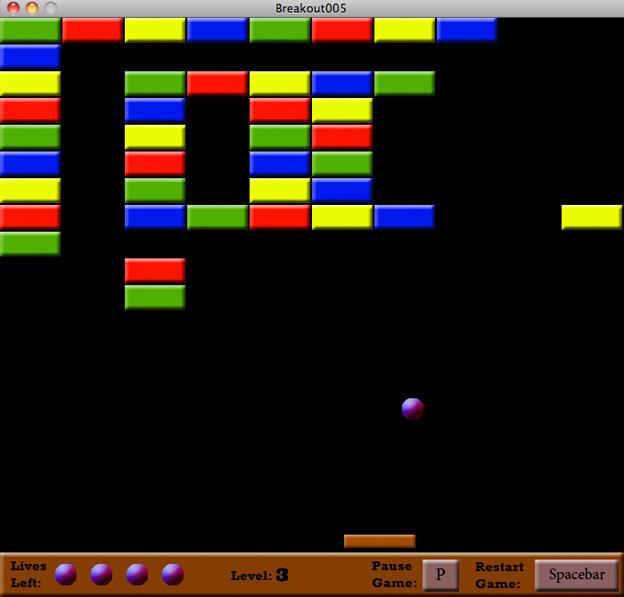

Breakout.js
======

An HTML5 Breakout game I wrote to learn how to use  `<canvas>` as well as the audio API. This is the third game in the
series of classic games I've written. The purpose is exercise in javascript, game development and design principles, and 
figuring out all the new HTML5 features.

[Click here to play!](https://projects-galcohen.rhcloud.com/breakout)

Controls
------------
* spacebar - start or retstart the game.
* p key - pause the game.
* left and right arrow keys - move the paddle
* mouse - move the paddle. (recommended method)
* n - advance to the next level.

Note:
------
This is a port of a game I wrote in Processing. I apologize if the code is a little funky in some places. It should work pretty well though... let me know if it doesn't.
Play it on my server [here](http://projects-galcohen.rhcloud.com/breakout/) 
Unlike the other two games, this one is still in development. 

